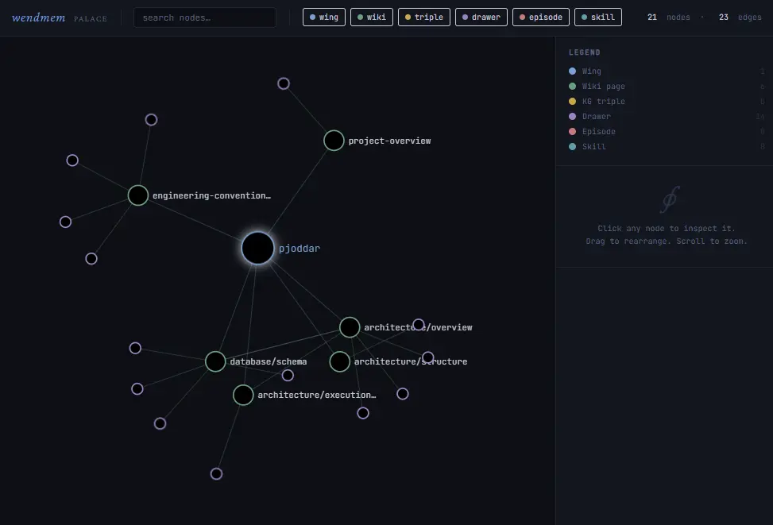

<div align="center">

# wend-mem

**A local-first, offline memory system for AI agents.**

Give your agents a compounding knowledge layer — semantically searchable, temporally tracked, and synthesized across sessions — instead of starting cold every time.

[](https://dotnet.microsoft.com/)
[](https://learn.microsoft.com/dotnet/csharp/)
[](https://learn.microsoft.com/dotnet/core/deploying/native-aot/)
[](https://duckdb.org/)
[](https://modelcontextprotocol.io/)
[](#license)

</div>

---

## Why wend-mem?

AI agents forget everything between sessions. Static instruction files (`CLAUDE.md`, `SKILL.md`) help, but they don't *evolve* — they can't record what was decided yesterday, what failed last week, or how this particular codebase actually works.

wendmem is the dynamic counterpart: a single-file knowledge server that any MCP-compatible agent (Goose, Claude Code, Claude Desktop, Cursor, Zed, …) connects to over stdio or HTTP. Agents read context at the start of a session, search it while they reason, and write back what they learn at the end — so knowledge **compounds** instead of evaporating.

Everything runs locally against one `.duckdb` file. No cloud, no separate vector database, no external services required for storage or retrieval.

---

## What Is wend-mem?

wendmem is a **persistent, structured memory for AI agents** — a place where everything an agent reads, decides, and learns is stored, organized, and made retrievable for every session that follows. Think of it less as a database and more as an external long-term memory that an agent can grow and consult on its own.

The design borrows the *memory palace* metaphor. Knowledge is organized spatially so both humans and agents can reason about where things live:

- A **Palace** is your entire knowledge base — one `.duckdb` file.
- A **Wing** is a namespace, usually one per project, person, or domain (`work`, `my-project`, `personal`). Wings keep contexts cleanly isolated so a search in one project never leaks into another.
- A **Room** is an auto-classified topic inside a wing (`code`, `docs`, `config`, `database`, …), derived from file type and content.
- A **Drawer** is the atomic unit: one ~800-character chunk of *verbatim* text with a vector embedding. Drawers are immutable and never paraphrased — the raw evidence is always preserved exactly as written.

On top of that raw layer, wendmem maintains two synthesized structures: a **wiki** of LLM-authored pages (every claim cited back to the drawers it came from), and a **temporal knowledge graph** of `subject → predicate → object` facts that can be marked valid-from / valid-until rather than destructively overwritten.

### How knowledge gets in

You feed wendmem in three ways:

1. **Mining files** — `wendmem mine ./src --wing my-project` recursively chunks a codebase or doc tree into drawers, skipping binaries and generated output, and only re-processing files that changed.
2. **Mining conversations** — transcripts of past agent sessions or meetings become searchable drawers.
3. **Live writes** — during a session, an agent calls `AddMemory` for a fact worth keeping, `AddTriple` for a relationship, or `WikiWrite` for a synthesis it just produced.

Ingestion is **idempotent**: a drawer's ID is the hash of its content, so re-mining the same material never creates duplicates.

### How knowledge comes out

Retrieval is **hybrid**, because no single method is enough on its own. A query runs through keyword search (BM25), semantic vector search (cosine), and a knowledge-graph entity channel in parallel; the three result lists are fused with Reciprocal Rank Fusion, boosted by a structured side-index, then diversified with Maximal Marginal Relevance so a handful of boilerplate chunks can't crowd out everything else. The result is that an agent can find an exact symbol name *and* a fuzzy conceptual match from the same tool surface.

### The compounding loop

What makes wendmem more than a search index is that it's designed to **get better with use**:

```
WakeUp ──► search while reasoning ──► AddMemory / AddTriple ──► RecordEpisode ──► Distill ──► WikiWrite
  ▲                                                                                              │
  └──────────────────────── next session starts with everything the last one learned ───────────┘
```

At session start an agent calls `WakeUp` and receives a curated map of the wing: synthesis pages, recent and semantically relevant drawers, active facts, and — crucially — the most relevant *past episodes* (what worked, what failed last time) and *skills* (procedural how-tos). As it works it searches for evidence rather than guessing. At session end it records the outcome and distills durable conclusions into cited wiki pages. The next agent that wakes up inherits all of it.

> wendmem is **entirely passive** — it does nothing unless an agent explicitly calls a tool. The intelligence lives in *when* the agent chooses to read and write; wendmem's job is to make those operations fast, structured, and safe.

### What it is *not*

- **Not a chatbot or an agent.** It has no goals of its own; it's the memory an agent uses.
- **Not a cloud service.** Storage and retrieval are fully local and offline. The only optional network call is to an LLM endpoint for distillation and reflection — and that can be a local Ollama or llama.cpp instance.
- **Not a plain vector store.** Vectors are one of several retrieval channels, sitting alongside full-text, knowledge-graph, and synthesis layers in a single file.

---

## Table of Contents

- [What Is wendmem?](#what-is-wendmem)
- [Key Features](#key-features)
- [Three-Layer Memory Model](#three-layer-memory-model)
- [Architecture](#architecture)
- [Tech Stack](#tech-stack)
- [MCP Tools](#mcp-tools)
- [Quick Start](#quick-start)
- [Run Modes](#run-modes)
- [Connecting an Agent](#connecting-an-agent)
- [CLI Reference](#cli-reference)
- [Configuration](#configuration)
- [Geometry-Aware Consolidation](#geometry-aware-consolidation)
- [Documentation](#documentation)
- [Contributing](#contributing)
- [License](#license)

---

## Key Features

- **Single-file persistence** — drawers, embeddings, full-text index, vector index, and knowledge graph all live in one DuckDB file.
- **Hybrid retrieval** — BM25 (FTS) + cosine (VSS/HNSW) + knowledge-graph entity matching, fused with Reciprocal Rank Fusion and diversified with MMR.
- **Compounding wiki** — LLM-authored synthesis pages with mandatory citations back to source drawers; new evidence is queued for review, never silently overwritten.
- **Temporal knowledge graph** — subject→predicate→object triples with `valid_from`/`valid_to`, so facts can be retired without losing history.
- **Episodic & procedural memory** — agents record what worked and what failed, and surface relevant past episodes and skills on the next session.
- **Geometry-aware consolidation** — near-duplicate drawers are merged only when it's mathematically safe to do so (see [below](#geometry-aware-consolidation)).
- **Native AOT** — ships as a self-contained binary with no .NET runtime dependency.

---

## Three-Layer Memory Model

| Layer | What it stores |
|-------|----------------|
| **Drawers** | Verbatim, immutable chunks — raw file excerpts, conversation snippets, pasted facts. Never summarized or paraphrased. |
| **Wiki pages** | LLM-maintained synthesis pages with mandatory citations back to source drawers. |
| **Knowledge graph** | Temporal entity-relationship triples (`subject → predicate → object`) with valid-from/until dates. |

Agents call `WakeUp` at session start to receive a palace map (wiki page index + active KG facts + semantic hits + relevant past episodes/skills), then drill into `WikiRead`, `SearchMemories`, or `GetDrawer` as needed.

---

## Architecture

```
Files / Conversations ──► FileMiner / ConversationMiner ──► DrawerStorage (DuckDB)
                                        │                          │
                                        ├── PendingUpdateService ──┘  (queues wiki review)
                                        └── ActivityLog
                                                                       │
User query / agent ──► PalaceSearcher ──► WakeUp / SearchMemories ─────┘
                              │
                              ├── L0: Synthesis drawers (all, unlimited budget)
                              ├── L1: Recent source drawers (5 most recent)
                              ├── L2: Semantic search with MMR diversification
                              └── Pending updates + active KG facts

MCP client (Goose / Claude / Cursor / Zed) ──► DrawerTools · WikiTools · KGTools
                                                · EpisodeTools · SkillTools
                                                · WikiMaintenanceTools ──► Services
```

---

## Tech Stack

| Component | Choice |
|-----------|--------|
| Runtime | .NET 10, C# 14, Native AOT |
| Database | DuckDB 1.5 (local file `palace.duckdb`) — FTS, VSS/HNSW, knowledge graph |
| Embeddings | EmbeddingGemma-300M via ONNX Runtime — 768-dim native → 512-dim Matryoshka truncation |
| Search | DuckDB VSS (cosine) + DuckDB FTS (BM25), RRF-fused, MMR-reranked |
| LLM | OpenAI-compatible endpoint via `Microsoft.Extensions.AI` (z.ai, Ollama, or llama.cpp) |
| Protocol | MCP over stdio (default) or HTTP |

---

## MCP Tools

wendmem exposes **17 MCP tools** across five groups. Every tool returns a structured response envelope (`success`, `result`, `decision_support`, `error`); `SearchMemories` additionally returns a `confidence` block.

### Retrieval

| Tool | Purpose |
|------|---------|
| `WakeUp` | Palace map: wiki index, active KG facts, MMR-diversified semantic hits, plus episodes/skills when a `seedQuery` is given. **Call first.** |
| `SearchMemories` | Hybrid BM25 + semantic + KG search over drawers. Results carry a `Regime` tag (Tight/Spread/Unknown). |
| `GrepExact` | Exact string or RE2 regex search over drawer content. |
| `GetDrawer` | Read one drawer by 16-char hex ID. Verbatim, read-only. |
| `WikiRead` | Read a wiki page by path. Returns markdown + citation list. |
| `WikiSearch` | Hybrid BM25 + semantic search over wiki pages. |

### Storage

| Tool | Purpose |
|------|---------|
| `AddMemory` | Store text as a new drawer. Idempotent on content hash; near-duplicates rejected. |
| `AddTriple` | Record a persistent fact (`subject → predicate → object`). Entities auto-created. |
| `InvalidateTriple` | Retire a previously-true fact by setting `valid_to`. Stays in history. |
| `WikiWrite` | Create or update a wiki page. Citations to drawer IDs are mandatory. |

### Episodes

| Tool | Purpose |
|------|---------|
| `RecordEpisode` | Record a task outcome — goal, plan, what worked, what failed, what to do next time. |
| `FindEpisodes` | Find past episodes relevant to the current goal, with optional outcome filter. |

### Skills

| Tool | Purpose |
|------|---------|
| `FindSkills` | Find procedural `SKILL.md` guides relevant to a task. Returns folder paths; the agent reads the file itself. |

### Wiki Maintenance

| Tool | Purpose |
|------|---------|
| `Distill` | Session-end housekeeping: crystallize drawer evidence into wiki page scaffolds. |
| `ListPendingUpdates` | List wiki pages with new drawer evidence queued for review. |
| `DismissPendingUpdate` | Dismiss a pending update without applying it. |
| `LintWiki` | 7-rule structural quality check (broken citations, orphans, stale pages, gaps, contradictions). |

> **Resource:** `palace://schema` — auto-generated document with wing info, routing keywords, and conventions.

---

## Quick Start

> **Prerequisites:** .NET 10 SDK, PowerShell 7+, Windows 11 (other platforms work where .NET 10 + ONNX Runtime are supported).

```bash
# 1. Clone
git clone <your-repo-url> wendmem && cd wendmem

# 2. Download the embedding model (~300 MB)
cd integrations && ./download-model.ps1 && cd ..

# 3. Publish + install integrations
pwsh -ExecutionPolicy Bypass -File ./Setup-Integrations.ps1

# 4. Run (stdio MCP server)
./Start-Wendmem.ps1
```

Then point your agent at the resulting `publish/Wendmem.exe` (see [Connecting an Agent](#connecting-an-agent)).

```bash
# Ingest a project and verify
wendmem mine ./src --wing my-project
wendmem stats
```

---

## Run Modes

| Mode | Command | Description |
|------|---------|-------------|
| **stdio MCP** (default) | `wendmem` | No args — starts the MCP server on stdin/stdout. |
| **HTTP MCP** | `wendmem serve` | Listens on `http://localhost:5133/mcp`. Stateless; override the port via `Palace:HttpPort`. |
| **CLI** | `wendmem <subcommand>` | Ingestion, inspection, and maintenance (see below). |

---

## Connecting an Agent

wendmem implements standard MCP — any compliant client works. Examples:

**Goose** (`~/.config/goose/config.yaml`):

```yaml
extensions:
  wendmem:
    name: wendmem
    type: stdio
    cmd: <install-path>\Wendmem.exe
    args: []
    envs:
      WENDMEM_DB: <path-to>\palace.duckdb
    description: "Personal knowledge bank — search, store, and synthesize memories"
    timeout: 300
```

**Claude Desktop / Cursor** (`mcpServers`, stdio):

```json
{
  "mcpServers": {
    "wendmem": {
      "command": "<install-path>\\Wendmem.exe",
      "env": { "WENDMEM_DB": "<path-to>\\palace.duckdb" }
    }
  }
}
```

For HTTP transport, run `wendmem serve` and connect to `http://localhost:5133/mcp`.

---

## CLI Reference

```bash
# Ingestion
wendmem mine <path> --wing W [--room R]        # Mine files/directories into drawers
wendmem mine-conversation <path> --wing W      # Mine a conversation transcript
wendmem sweep <path> --wing W [--fix]          # Scan for missed/stale files; --fix re-mines

# Maintenance
wendmem prune --wing W [--threshold 0.97]      # GAC prune: geometry-aware soft-retire
wendmem distill --wing W --summary <text>      # Prepare a session summary for wiki filing
wendmem calibrate --wing W [--samples N]       # Tune retrieval thresholds for a wing

# Wiki & pending
wendmem wiki list [--wing W]                   # List wiki pages
wendmem wiki lint [--wing W]                   # Health check (BrokenCitation, OrphanPage, …)
wendmem wiki read <path>                       # Read a wiki page
wendmem pending list --wing W                  # List the evidence review queue
wendmem pending dismiss --page P --drawer ID   # Dismiss an update from the queue

# Inspection
wendmem stats                                  # Palace statistics
wendmem wings                                  # List all wings with drawer counts
wendmem activity [--wing W] [--limit N]        # Recent palace operations
wendmem search <query>                         # FTS (BM25) search
wendmem search-semantic <query>                # Cosine similarity search
wendmem grep-exact <pattern>                   # Exact string or regex search
wendmem graph --wing W [--output path]          # Generate interactive HTML knowledge graph
```



The full command set (episodes, skills, reflection, knowledge-graph resolution, salience rescoring, …) is documented in [`documentation/06-cli-commands.md`](documentation/06-cli-commands.md).

---

## Configuration

The LLM backend lives in `src/Wendmem/appsettings.json` under the `Llm` section. Override any value via environment variables using `__` as the hierarchy separator (e.g. `Llm__Provider=Ollama`).

| Provider | `Llm:Provider` | Endpoint | Auth |
|----------|----------------|----------|------|
| **z.ai** (default) | `ZAi` | `https://api.z.ai/api/paas/v4/` | `ZAI_API_KEY` env var or `Llm:ZAi:ApiKey` |
| **Ollama** | `Ollama` | `http://localhost:11434/v1/` | placeholder `"ollama"` |
| **llama.cpp** | `LlamaCpp` | `http://localhost:8080/v1/` | placeholder `"llamacpp"` |

Retrieval, ranking, chunking, admission control, and WakeUp behaviour are all configurable under the `Palace` section. See [`documentation/configuration.md`](documentation/configuration.md) for the full reference.

---

## Geometry-Aware Consolidation

Over time, repeated mining creates near-duplicate drawers. Naive deduplication collapses distinct memories into one. wendmem's **GAC prune** routes every cluster through a geometric inequality before deciding what to keep:

> **ε_id ≥ 1 − c₁ · (θ′ / d̄_C)^(d_eff/2)**

where d̄_C is the mean intra-cluster cosine distance, d_eff ≈ 16 for EmbeddingGemma-300M, and θ′ = 1 − θ is the retrieval cap. Two regimes emerge:

| Regime | Condition | Behaviour |
|--------|-----------|-----------|
| **Tight** | d̄_C < θ′ | Safe to consolidate — one medoid covers all cluster members. |
| **Spread** | d̄_C ≥ θ′ | Identity collapse guaranteed — multiple representatives required. |

Pruning is always reversible: it soft-retires (`is_representative = FALSE`) rather than hard-deleting, and search results carry a `Regime` tag so agents can weight their trust accordingly.

Theoretical background: [**geometry-of-consolidation**](https://github.com/niashwin/geometry-of-consolidation).

---

## Documentation

The [`documentation/`](documentation/) folder is the authoritative, code-accurate reference:

| File | Description |
|------|-------------|
| [00-overview](documentation/00-overview.md) | What wendmem is, data model, architecture, tech stack |
| [01-ingestion](documentation/01-ingestion.md) | Filling wendmem — mining, conversations, manual memories |
| [02-search-retrieval](documentation/02-search-retrieval.md) | WakeUp, SearchMemories, Grep, GetDrawer |
| [03-pruning-maintenance](documentation/03-pruning-maintenance.md) | Pruning, consolidation, cluster geometry |
| [04-wiki-knowledge-graph](documentation/04-wiki-knowledge-graph.md) | Wiki pages, KG triples, citations |
| [05-mcp-tools](documentation/05-mcp-tools.md) | All MCP tools with parameters and examples |
| [06-cli-commands](documentation/06-cli-commands.md) | All CLI commands with flags |
| [07-workflows](documentation/07-workflows.md) | Optimal workflows for common tasks |
| [08-connecting-agents](documentation/08-connecting-agents.md) | Connecting Goose, Claude, Cursor, Zed, any MCP client |

---

## Contributing

Contributions, issues, and feature requests are welcome. A few notes for working in this codebase:

- Targets **.NET 10 / C# 14** — primary constructors, records, pattern matching, collection expressions.
- **Native AOT compatible**: no reflection-based JSON (use `JsonSerializerContext` source generators), no runtime `Regex` (use `[GeneratedRegex]`).
- `async`/`await` throughout — no `.Result` / `.Wait()`.
- YAGNI: no abstractions before they earn their place.
- Run the test suite before opening a PR.

---

## License

**Apache License 2.0 with the Commons Clause** — a source-available license. See [`LICENSE`](LICENSE) for the full text.

In plain terms: you may view, compile, run, modify, and redistribute the code freely — including for internal and commercial use within your own organization. What you **may not** do is *sell* the software, where "Sell" means providing to third parties, for a fee, a product or service whose value derives entirely or substantially from wendmem's functionality (this includes hosting it as a paid service).

> This is a "source-available" license, not an OSI-approved open-source license — the no-sell restriction places it outside the Open Source Definition. If you'd like to use wendmem in a way the Commons Clause prohibits, contact the author to discuss a commercial license.

Copyright © 2026 Jonas Wendin.

---

## Author

Built and maintained by **Jonas Wendin**.

For commercial licensing inquiries or questions about the project, open an issue or reach out via [GitHub](https://github.com/<your-handle>).
